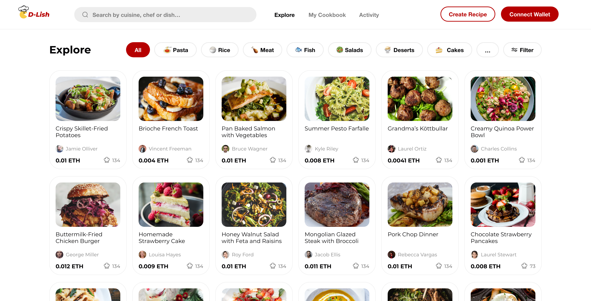
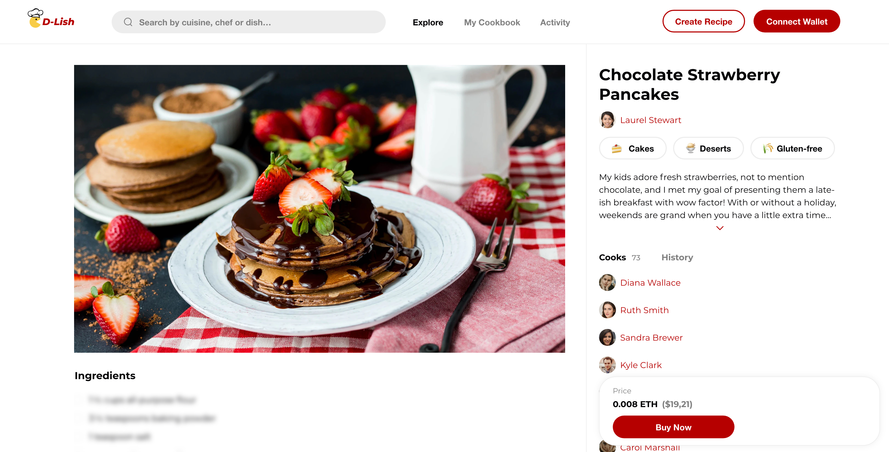

# 👌 D-Lish

Here is a dapp dedicated to recipe creators, professional chefs and food enthusiasts! Those who want to share their creations with the world. 

🌟 And do you know the great thing about our dapp?! Once the non-fungible token (NFT) is resold, the original NFT creator is compensated with 15 percent of the earnings. We at PiñaPay (http://pinapay.io/) want to ensure that all of our creators receive residual income for their content.
  

## 👨‍🍳 Your Recipe, Your Token!

Simply buy recipes or make an offer to bid!

## Future Implementations

We want to improve transaction speed and fees without ruining user experience. That's where the Polygon network (https://polygon.technology/) comes into play. With this Layer 2 technology, we intend to reduce gas prices so that our users can focus all of their time and energy on what they love, creating new recipes and learning new styles of cooking from around the Globe!
